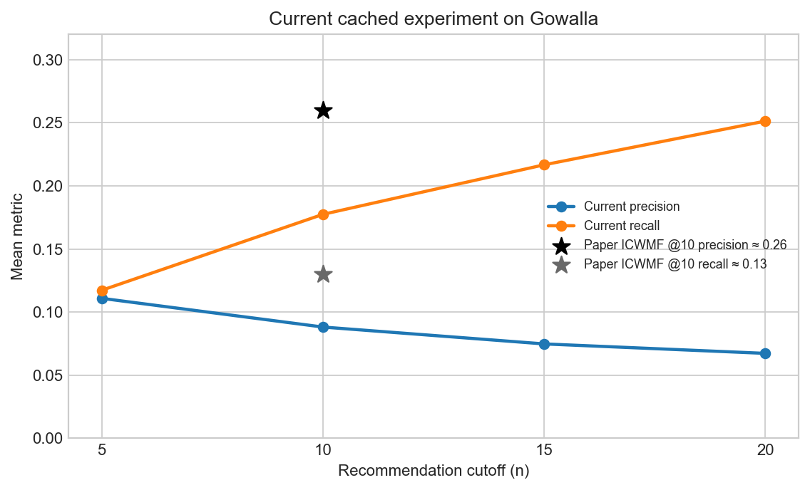

# ICWMF on Gowalla

This repository contains a research implementation of **Improved Context-Aware Weighted Matrix Factorization (ICWMF)** for point-of-interest (POI) recommendation in a location-based social network (LBSN). The implementation follows the formulation and parameter values reported for the Gowalla experiment in the paper by Xu Zhou and colleagues.

> **Reproduction status.** This is a paper-oriented implementation, not a claim of exact numerical reproduction. The exact filtered Gowalla subset and several details of the paper's train/test protocol are not available in the paper. The cached values shown below are therefore an experimental reference point and should not be presented as the paper's own measurements.

## Paper

The implementation is based on:

> Zhou, X., Wang, Z., Liu, X., Liu, Y., and Sun, G. “An improved context-aware weighted matrix factorization algorithm for point of interest recommendation in LBSN.” *Information Systems*, vol. 122, 2024, article 102366. https://doi.org/10.1016/j.is.2024.102366

BibTeX:

```bibtex
@article{zhou2024icwmf,
  author  = {Zhou, Xu and Wang, Zhuoran and Liu, Xuejie and Liu, Yanheng and Sun, Geng},
  title   = {An improved context-aware weighted matrix factorization algorithm for point of interest recommendation in LBSN},
  journal = {Information Systems},
  volume  = {122},
  year    = {2024},
  pages   = {102366},
  doi     = {10.1016/j.is.2024.102366}
}
```

## Method overview

The notebook implements the main components of the paper's ICWMF pipeline:

- temporal preference using an Ebbinghaus-style decay function;
- geographic preference from a Gaussian distance model and user-specific nearby POIs;
- user-level geographic regions estimated with DBSCAN and a power-law distance model;
- social preference from the Gowalla friendship graph;
- the combined context term `D = eta * Geo_P + (1 - eta) * F_soc`;
- confidence weighting for implicit feedback, followed by sparse ALS matrix factorization;
- top-`n` precision and recall evaluation.

The notebook also includes diagnostics for the data split, graph construction, context matrices, ALS convergence, and recommendation coverage.

## Paper-aligned configuration

The current notebook is configured around the values reported in the paper:

| Parameter | Value |
|---|---:|
| Latent factors `K` | 300 |
| Temporal window `H` | 100 days |
| Confidence parameter `alpha` | 10 |
| `lambda_U`, `lambda_V` | 0.015 |
| Location regularization `lambda_T` | 0.0004 |
| Context mixture `eta` | 0.5 |
| Geographic neighbors `n_k` | 25 |
| Gaussian bandwidth `sigma` | 0.1 |
| Minimum user/POI visits | 10 |
| Train ratio | 80% |

The notebook uses a resource-conscious sampling mode with a target of 2,150 users. Graph closure and filtering can produce fewer users and POIs in the resulting working set; this is one reason the local run is not numerically identical to the paper's Gowalla table.

## Data

The Gowalla check-in and friendship files are intentionally **not included** in this repository because of their size and dataset redistribution considerations. Obtain the data from the [SNAP Gowalla dataset page](https://snap.stanford.edu/data/loc-gowalla.html), then place the files expected by the first notebook cells in the project directory:

```text
Gowalla_totalCheckins.txt
Gowalla_edges.txt
```

The notebook also recognizes the corresponding gzip-compressed files. Raw data files, generated caches, exported HTML reports, local documents, and archives are excluded by `.gitignore`.

## Running the implementation

```powershell
python -m venv .venv
.\.venv\Scripts\Activate.ps1
python -m pip install -r requirements.txt
jupyter lab
```

Open `Ali_Etemadfard_ICWMF_Gowalla.ipynb`, restart the kernel, and run all cells from top to bottom. The notebook generates intermediate artifacts under `cache/`; these artifacts are local and are not intended to be committed.

To regenerate the tracked result figure after a successful notebook run:

```powershell
python scripts/plot_results.py
```

## Current cached reference results

The following values come from the cached `RESOURCE_MODE` experiment currently present in the working directory. It contains 1,606 users and 6,888 POIs; 1,301 users have at least one test item and are included in the reported averages.

| Cutoff | Precision | Recall |
|---:|---:|---:|
| 5  | 0.1108 | 0.1172 |
| 10 | 0.0881 | 0.1774 |
| 15 | 0.0747 | 0.2167 |
| 20 | 0.0672 | 0.2513 |

For comparison, Figure 3 of the paper reports approximately **Precision@10 = 0.26** and **Recall@10 = 0.13** for ICWMF on Gowalla. These numbers are not directly comparable because the local run uses a different realized subset and an incompletely specified split protocol. The paper reports 2,150 users and 6,668 POIs, while the cached local run reports 1,606 users and 6,888 POIs.



## Why recall became the focus

Recall is a meaningful measure for POI discovery because it measures how many of a user's held-out relevant POIs are successfully surfaced. This matters particularly for sparse implicit-feedback data: an unobserved check-in does not necessarily mean that the user dislikes a POI. A system that retrieves more of the user's genuinely relevant locations can provide better coverage and reduce missed recommendation opportunities, especially for less frequently visited or less popular POIs.

In the current cached run, Recall@10 is **0.1774**, compared with approximately **0.13** reported for ICWMF on Gowalla in the paper. This is the strongest relative outcome of the local implementation and was the reason recall became the main optimization target. The temporal, geographic, and social context signals were retained to improve candidate coverage and recover more relevant held-out POIs instead of over-concentrating recommendations on a small set of highly popular locations.

This comes with a clear precision trade-off: Precision@10 is **0.0881** in the cached run, so increasing recall does not automatically mean that every recommendation is relevant. Precision remains an important future improvement target, but for this stage the priority was to avoid missing relevant POIs and to make the recommendation list more exploratory. Because the paper does not fully specify the exact subset construction, split unit, and all preprocessing choices, the recall comparison should be interpreted as an implementation-level result rather than an exact reproduction claim.

## Repository layout

```text
Ali_Etemadfard_ICWMF_Gowalla.ipynb   Main implementation and experiments
requirements.txt                      Python dependencies
scripts/plot_results.py               Recreates the tracked result figure
results/precision_recall_current.png  Figure used in this README
```

## Limitations and responsible reuse

This repository is intended as an educational and research reproduction. Exact paper-level results require the same Gowalla subset, preprocessing, random split, evaluation filtering, and implementation details used by the authors. The article PDF and project archives are not committed; the published article should be cited using the DOI above. Before redistributing the dataset or deploying recommendations, check the dataset's terms of use and the applicable privacy requirements.

